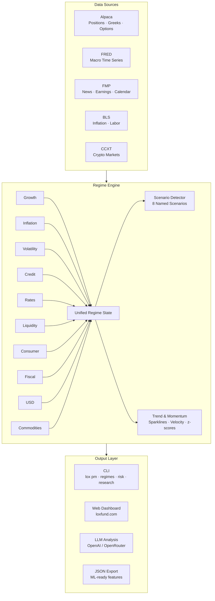

# Lox

**Macro regime research platform for discretionary portfolio management.**
CLI + live web dashboard — built for a PM morning risk meeting workflow.

[](https://www.python.org/downloads/)
[](LICENSE)
[](https://loxfund.com)

---

## What is Lox?

Lox is a systematic macro research platform that scores 10 economic regime pillars (0–100), detects cross-regime scenarios, and translates regime state into portfolio-level risk signals. It combines a full-featured CLI for daily research workflows with a live web dashboard for real-time fund monitoring — designed to feel like a PM morning risk meeting, not a generic research report.

---

## Live Dashboard — [loxfund.com](https://loxfund.com)

The web dashboard is a Flask application deployed on Heroku with live data refresh, providing real-time fund analytics without touching the terminal.

**Fund Performance & Positions**
- Real-time NAV, unrealized P&L, and cash metrics
- Open positions with AI-generated thesis for each trade
- Closed trade history with full performance attribution

**Regime Deep-Dives**
- 12 macro regime pillars scored 0–100 with color-coded stress bands
- AI-powered contextual analysis refreshing every 30 minutes
- Interactive metric breakdowns with weighting toggles

**Trade Performance Analytics**
- Performance grade (A–F) with quant metrics: Sharpe ratio, profit factor, expectancy, max drawdown
- Payoff analysis, R-multiple, Kelly %, win/loss streaks
- Distribution stats: standard deviation, skewness, average hold time

**Lived Inflation Index**
- Bespoke inflation metric reweighted by purchase frequency
- Purchasing power erosion since Jan 2020 vs. official CPI
- Category breakdown: housing, food, utilities, discretionary
- Consumer profile scenarios and wage gap analysis

**Investor Portal**
- Authenticated login with per-investor capital tracking
- Personal NAV per unit, holdings, and performance history

**Stack:** Flask, Chart.js, PostgreSQL (Heroku), live data from Alpaca + FRED + FMP + BLS

---

## CLI — PM Morning Report

Your daily hedge fund briefing in one command. Combines macro regime state, active scenarios, portfolio Greeks, and a streaming LLM CIO brief.

```
$ lox pm

╭─ LOX CAPITAL — PM MORNING REPORT  Mar 6 2026 ────────────────────────╮
│ Composite Risk: 56/100 (CAUTIOUS)    Quadrant: MIXED                  │
│ NAV: $13,306    Day P&L: +$291 (+2.2%)    Inception: +$2,906 (+27.9%)│
╰───────────────────────────────────────────────────────────────────────╯

[1] MACRO REGIME
  Pillar      Bar                Score  Arrow  Δ7d   Regime
  Growth      █████░░░░░░░░░░░░    54     ▼▼    -2   STABLE GROWTH
  Inflation   ██████░░░░░░░░░░░    56      —     0   ELEVATED
  Volatility  █████████░░░░░░░░    67     ↑↑   +16   ELEVATED VOL
  Credit      ████████░░░░░░░░░    62      ↑    +4   WIDENING
  Rates       ██████░░░░░░░░░░░    58      ↑    +2   RESTRICTIVE
  Liquidity   █████░░░░░░░░░░░░    48     ▼▼    -6   ADEQUATE
  Consumer    ██████░░░░░░░░░░░    55      —     0   CAUTIOUS
  Fiscal      ███████░░░░░░░░░░    61      ↑    +3   DEFICIT STRESS
  USD         █████░░░░░░░░░░░░    44      ▼    -1   NEUTRAL
  Commodities █████████░░░░░░░░    65      ↑    +5   SUPPLY STRESS

[2] ACTIVE SCENARIOS
  HIGH    TRADE WAR ESCALATION (4/4 triggers) → LONG GLD, SHORT HYG
  MEDIUM  Oil Supply Shock (2/3 triggers)     → SHORT XLE puts
  MEDIUM  Credit Stress (3/5 triggers)        → LONG TLT

[3] PORTFOLIO
  Delta: -201    Gamma: +53.93    Theta: $-52/day    Vega: +506
  ⚠ Net short delta — exposed to rally
  ✓ Long gamma — convexity in your favor
  ⚠ Theta burn $52/day vs $13,306 NAV = 39bp/day

[4] PM BRIEFING (streaming)
  Vol spiked +16 to 67 — VIX at 23.8 with term structure inverting.
  Trade War scenario at HIGH conviction — tariff headlines driving
  credit wider and equities lower. Book is positioned correctly:
  short delta benefits from sell-off, long gamma gives convexity...
```

```bash
lox pm                # Full report with LLM briefing
lox pm --no-llm       # Data sections only
lox pm --json         # Machine-readable JSON
```

---

## Regime Engine

10-pillar macro regime system scoring 0–100 (higher = more stress). Each pillar uses a 3-layer classifier with weighted sub-scores, cross-signal confirmation, and sector/factor decomposition.

```bash
lox research regimes              # Overview with trend arrows + 7d deltas
lox research regimes --trend      # Full trend dashboard (sparklines, momentum z, velocity)
lox research regimes --detail credit   # Deep dive on one pillar + trend panel
lox research regimes --scenarios  # Active macro scenarios (conviction-ranked)
```

**Pillars:** Growth, Inflation, Volatility, Credit, Rates, Liquidity, Consumer, Fiscal, USD, Commodities

**Enrichments per pillar:**
- `--llm` — LLM chat with regime context injected
- `--book` — Map regime to your open positions (tailwind/headwind signals)
- `--trades` — Instrument-level trade ideas
- `--features` — ML-ready JSON feature vectors
- `--alert` — Silent unless regime is extreme (for cron monitoring)
- `--calendar` — Upcoming catalysts

**Scenarios:** 8 named macro scenarios (Stagflation, Credit Crunch, Goldilocks, Trade War, etc.) auto-evaluated against live regime state with HIGH/MEDIUM conviction scoring.

---

## Risk Dashboard

Portfolio-level Greeks with theta breakeven analysis and exposure decomposition.

```bash
lox risk              # Full Greeks dashboard + theta breakeven
lox risk --json       # Machine-readable export
```

**What it covers:**
1. Account snapshot — equity, buying power, options BP
2. Portfolio Greeks — consolidated delta, gamma, theta, vega
3. Exposure by underlying — per-name delta decomposition
4. Position detail — every position with Greeks, IV, and P/L
5. Risk signals — auto-generated warnings (exposure, gamma, theta, vol, leverage)
6. Theta breakeven — delta breakeven and gamma scalp breakeven per name
7. Theta burn — daily/weekly/monthly/annual projections vs. NAV

---

## Research Suite

```bash
lox research ticker NVDA          # Hedge-fund-style research report
lox research portfolio            # Outlook on all open positions
lox research scenario SPY \
  --oil 80 --cpi 3.1 --vix 30    # Monte Carlo macro shock simulation
lox research chat                 # Interactive research chat
lox scan -t NVDA --want put       # Options chain scanner with Greek filters
```

---

## Crypto Perps

Real-time crypto perpetual futures data, LLM-powered analysis, and manual trading via Aster DEX.

```bash
lox crypto data                   # BTC, ETH, SOL overview + technicals
lox crypto research               # Data + macro regime LLM analysis
lox crypto trade BTC BUY 0.001 --leverage 5
lox crypto positions              # Open positions with PnL
```

---

## Architecture



---

## Quick Start

```bash
git clone https://github.com/pythonjeff/lox.git
cd lox
pip install -e ".[dashboard]"
cp .env.example .env
# Edit .env with your API keys (see below)
lox pm                # Run your first morning report
```

---

## API Keys

| Service | Purpose | Required? |
|---------|---------|-----------|
| [Alpaca](https://app.alpaca.markets/) | Brokerage, positions, options data, Greeks | Yes |
| [OpenAI](https://platform.openai.com/api-keys) or [OpenRouter](https://openrouter.ai/keys) | LLM analysis | For `--llm` / `lox pm` |
| [FRED](https://fred.stlouisfed.org/docs/api/api_key.html) | Macro/economic time series | Yes |
| [FMP](https://financialmodelingprep.com/developer/docs/) | News, calendar, earnings, quotes | Yes |
| [Trading Economics](https://tradingeconomics.com/api/) | Consumer/macro indicators | Optional (falls back to FRED) |
| [Aster DEX](https://app.asterdex.com/) | Crypto perps trading | For `crypto trade` only |

---

## Documentation

| Document | Description |
|----------|-------------|
| [CLI Reference](docs/CLI_REFERENCE.md) | Full command reference and daily workflows |
| [Architecture](docs/ARCHITECTURE.md) | System design and module layout |
| [Methodology](docs/METHODOLOGY.md) | Palmer, Monte Carlo, regime detection algorithms |
| [Technical Spec](docs/TECHNICAL_SPEC.md) | Data lineage, error handling, deployment |
| [Changelog](docs/CHANGELOG.md) | Version history and recent upgrades |

---

## License

[MIT](LICENSE)
